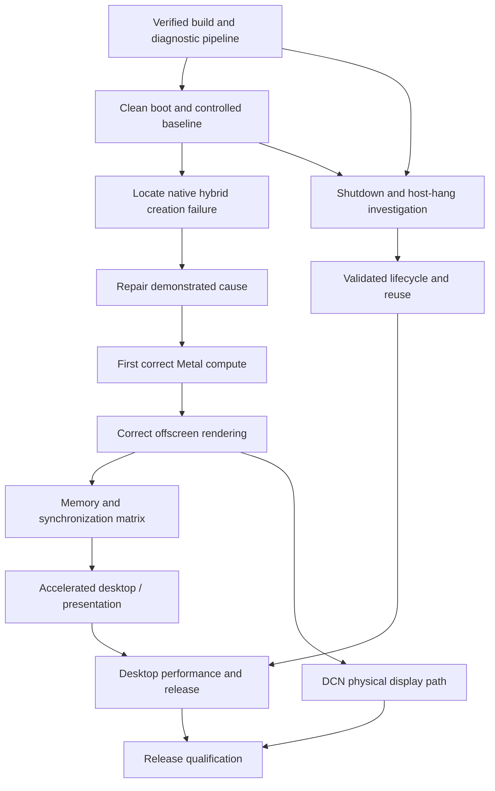

# Raphael iGPU acceleration roadmap

Updated 2026-09-09. Historical hardware snapshot: candidate 1.0.178-B. The bounded 178-A/B sequence completed the third measured
cleanup-to-restart transition on this host boot; its terminal ledger is 6/6 and admits no
seventh launch;
published research snapshot: `v1.0.159-preview.1`. This document is the authoritative current roadmap.
Historical hypotheses in `findings/GPU-RE.md` remain evidence, not instructions. After every
three actual GPU attempts, refresh `status.md`, complete the required Astra review, and revise
the hypothesis and discriminating test before another attempt; builds and parser runs do not
count as attempts.

**Objective:** real, correct GPU compute and rendering in the Sequoia VM on the existing
Raphael iGPU, followed by usable desktop rendering through the VM display and a repeatable
lifecycle, while protecting the host. Enumeration, compilation and a working KIQ
are intermediate milestones. No finite test can guarantee that the host will never hang.

[Task-by-task execution plan](superpowers/plans/2026-09-08-gpu-acceleration.md).
[Raphael versus Navi23 in Linux](../findings/raphael-vs-navi-linux.md) is the current
block-by-block compatibility audit and defines the triggers for any further adaptation.

Execution update: the fresh amdgpu boot is captured, the sleep inhibitor is active,
and [the fixed baseline audit](../findings/baseline-audit.md) records enabled
interventions. Candidate 1.0.163 adds concurrent critical records and build markers.
The Python suite and seven C++ fixtures run locally and in GitHub CI.
[GPU-less end-to-end validation](../findings/gpueless-tests/163/coordinator/notes.md)
confirmed exact delivery and cleanup. T1–T4 are complete.
[Physical experiment164](../findings/experiments/hybrid-002-164/notes.md) proved the
third request is SDMA type0/global-index1 and fails because TTL discovered exactly one
SDMA instance. X6000 unconditionally constructed two Navi23 SDMA objects. Candidate
1.0.165 completed the gated one-instance correction and TTL initialization on hardware,
then exposed X6000's residual SDMA1 channel lookup: `getHWChannel` returned null and
`createAccelChannels+0x278` dereferenced it. Candidate 1.0.166 adds the guarded channel
mapping to the surviving physical SDMA0 engine. The host remained healthy, but the panicked
guest required a targeted force-stop. A rootless VFIO transaction has since destroyed both PSP
rings with exact acknowledgements while PCI bus mastering remained disabled. Candidate 166 then
reinitialized on that recovered state, completed native engine startup and advanced KIQ stamps
through 21. A second post-stop recovery also succeeded. The Metal probe was withheld by a now-fixed
snapshot-classification bug. The third launch then completed three early KIQ stamps but found
sixteen active ME2 HQD selections inherited from the fully started previous guest and timed out
before the probe. PSP teardown is therefore only one part of reuse; candidate 168 adds a
source-backed GC/HQD and SDMA quiesce transaction plus bounded ACPI shutdown fallback. Live
readback validated the corrected SDMA register path and PSP commands, but opening legacy VFIO
silently invoked the device's only `bus` reset method first. That reset is unsafe because the bus
also contains host APU functions and it confounds the queue-state evidence. Candidate 168 now
requires reset methods to be disabled during the privileged one-way handoff before any VFIO open.
Candidate 169 repairs the next measured address defect: X6000 emitted an SDMA indirect-buffer
address in the low-36-bit projection of the software framebuffer aperture. The route converts
only that exact projection into the validated MC aperture before native submission. Its first
clean launch reached KIQ stamps 1 through 4, but the coordinator read an unterminated replay
line and force-stopped QEMU before the SDMA template was submitted. That abort contaminated the
CP. The next launch failed its first KIQ stamp. Read-only VFIO then measured
`CP_STAT=0x80008200` and `CP_CPC_BUSY_STAT=0x08080000` after the old cleanup had marked every
engine halted. Candidate 169's SDMA repair therefore remains hardware-unresolved.

The coordinator now ignores an unterminated serial tail, uses the explicit `submitKIQFrame`
result when present, and requests bounded guest/ACPI shutdown after runtime observation
errors. Recovery authorizes another launch only when dequeue had no timeout or force-clear and
both CP status registers are idle. The driver also calls Apple's native
`powerOffHWEngines` immediately after partial engine power-up failure, while the guest mappings
still exist. Candidate 170 then completed native startup and KIQ stamp 34 on a fresh boot before
SDMA0 paging stalled on IB `0x400100020`. The old wrapper logged the unchanged fixed channel
template at `0xffbfde011c`, proving it patched the wrong value. Exact 24G830 disassembly now traces
the SDMA packet address to `AMD_SUBMIT_COMMAND_BUFFER_INFO + 0x58 + 0x28*i`. Linux SDMA 5.2 emits
the full address together with the IB's VMID. Candidate 170 identifies the stalled WindowServer
submission as VMID 2, so `0x400100020` must be evaluated through VMID 2's page tables rather than
rewritten as an MC physical address. Candidate 171 confirmed the VMID and address, but its
`programAndInvalidateVM` hook never ran: Apple builds the relevant VM program inside the SDMA
command stream. The first SDMA0 paging timeout preceded a later KIQ stamp 28 failure; the
classifier now preserves raw terminal ordering. The BAR5-era reset-free recovery dequeued both
active HQDs on the first poll, left both CP status registers idle, halted SDMA and confirmed both
PSP teardown commands without a host fault. That evidence did not execute a graphics UNMAP
packet and is no longer sufficient to authorize reuse after a fully started guest. Candidate 172
captures all 21 dwords returned by `prepareVMInvalidateRequest`. Static comparison selected the
high-confidence defect for candidate 173: Apple's VMID-2 root remains in the logical framebuffer
domain while GFXHUB consumes the physical domain. Candidate 173 converts only that root in a
private request copy behind `rgpuvmroot=1`, verifies Apple's output, and records correlated live
registers plus three page-table walks. This remains diagnostic until hardware shows whether each
non-SYSTEM child PDE is already physical; the walker never repairs what the GPU consumes.
Candidate 174 removed invalidate-semaphore diagnostic reads, eliminating their documented
acquisition risk, and preserved all bounded critical records. Its one controlled launch stopped
earlier: PM4/KIQ preflight reported
`BAR0 mapping unavailable` and `startKIQ` refused to proceed. The PM4 engine returned failure and
the native partial cleanup completed. No KIQ submission, VMID-2 callback or page-table walk ran,
so the root repair and walker remain untested on hardware. The guest shut down cleanly. Normal
recovery then failed closed because the guest had never activated the host-KIQ reservation; this
result does not authorize another same-boot launch. The current repair retries BAR0 mapping until
successful and can reach the published hardware owner through `AMDHWMemory+0x10` before the later
global hardware pointer is available. It caches only a successful mapping and caps both allocator
ranges before `enableAllocations` populates them. The complete kext compiles and the ordering,
early-owner/retry fixture and KDK preflight pass offline; none of this is hardware validation.
The [reviewed startup-only no-queue cleanup](../findings/recovery-tests/startup-noqueue-174-live/notes.md)
has since run once on candidate 174's exact stopped state and produced an authorizing schema-4
receipt. It found no active compute or graphics queue, halted the already-idle engines, received
both exact PSP destroy acknowledgements, consumed the PENDING reservation last, and recorded no
new host kernel message or fault. Candidate 1.0.175 then used that receipt once. Its early-owner
repair mapped BAR0, activated the current-run reservation, passed three native KIQ submissions,
and completed native engine and accelerator startup. This confirms the BAR0 hardware repair.
The probe did not run because the coordinator required workload-generated VMID-2 diagnostics
before it would start the workload; the final verdict remains strict while the readiness gate is
corrected and tested offline. Normal schema-5 recovery after shutdown dequeued two MEC HQDs, but its
host-KIQ fence value was not observed through BAR0 and its write-pointer clear did not read back.
Either the selected HQD RPTR or the VRAM RPTR report reached `0x100`, and graphics became inactive
before scrub, but the exception path discarded the exact terminal HQD RPTR, report and fence
fields. Recovery is `incomplete` and non-authorizing even though final ACTIVE and doorbell samples
were zero. Full Metal execution, VMID-2 root repair, and repeatable normal recovery remain
unproven. See the [candidate-175 evidence](../findings/experiments/metal-008-175-bar0/notes.md).

A later bounded, BAR0-only observation preserved the stopped state and found the complete 64 KiB
host-KIQ ring byte-exact. The embedded sequence and retained fence both equaled decimal
`1719349093` (`0x667b2f65`), while the RPTR report and stored WPTR were `0x100`. The MQD differed
only in six lifecycle-status dwords: its two time pairs and final RPTR/WPTR; the other 506 dwords
matched. No reset method or new host fault was observed. This result is diagnostic and explicitly
nonauthorizing, and it does not prove Metal execution. Because the observer read the ring, MQD,
pointers and EOP block before the fence, its positive fence read does not prove that HDP caching
could not have hidden the value from the earlier recovery poll. Linux's PCI-aperture path requires
HDP read-cache invalidation and a full barrier before reads. That missing path is now corrected and
covered by 247 offline Python tests, but it is not hardware-qualified and is not proven as the
cause of candidate 175's failed fence observation. See the
[retained host-KIQ archive](../findings/recovery-tests/retained-kiq-175/notes.md).

The retained sequence/fence equality proves that the temporary host KIQ reached its completion
fence at some point, while leaving the earlier BAR0 visibility failure's cause unresolved. A
separately reviewed stopped-state preparation then cleared SDMA0 PAGE IB enable before PAGE RB
enable, preserving every other control bit and reading both values back. Its following native
`CP_HQD_PQ_WPTR_LO=0` store was ignored: selector 9 remained inactive with WPTR `0x100`. No launch
was authorized or attempted. Exact Apple 24G830 analysis found that the inactive KIQ creation path
skips the pointer-reset block before programming and activating the replacement queue. The bounded
candidate-176 guard closes that path before native activation and passes all eight C++14 fixtures,
but it has not yet been built or tested on hardware. The exact stopped-state result is archived in
[retained KIQ preparation](../findings/recovery-tests/retained-kiq-preparation-175/notes.md).

A following one-shot transaction used the stopped queue's native 64-bit doorbell path while
selector 9 was inactive, MEC was halted and ingress was otherwise disabled. It cleared the retained
WPTR from `0x100` to zero without activating the queue or producing a host fault. The doorbell HIT
status remained set, and the global status changed from `0x2` to `0x3`; a separate pinned closure
then cleared only `CP_PQ_STATUS.DOORBELL_ENABLE`, reading `0x1` back while preserving the status
bit. Stable final scans kept all 64 HQDs inactive, selector 9's pointers zero, the engines halted
and idle, PAGE inputs disabled, and every doorbell enable clear. Both transactions are diagnostic
and nonauthorizing. They prove the bounded stopped-pointer update mechanism used by the planned
normal-recovery correction; they do not authorize candidate 176 or prove repeatable recovery. See
the [doorbell-zero and closure archive](../findings/recovery-tests/retained-kiq-doorbell-zero-175/notes.md).

The schema-6 normal-recovery producer and validator now preserve PAGE IB-then-RB shutdown evidence,
require the PAGE/GFX/RLC inputs disabled and SDMA idle, and accept selector doorbell cleanup only as
exact zero or HIT-only with the enable bit clear. The integrated focused suite passes offline. This
schema first ran on hardware after candidate 176. Physical cleanup completed, but the receipt does
not validate under the run's committed consumer because its GART check conflates the
allocator-excluded reservation with the much smaller ranges recovery actually writes. Independent
review narrowed only the schema-6 exclusion to the exact descriptor and conservative host-KIQ
mutation spans; 346 tests pass and both immutable receipt serializations now validate with `[]`.
The old failed schema-5 receipt remains unchanged.

Candidate 1.0.176 used the reviewed same-boot continuation once. It repeated candidate 175's native
KIQ, SDMA, engine and outer accelerator startup success, then passed the corrected readiness gate and
ran the prepared Metal probe. The first compute command ended in status 5 with underlying
`e00002bd` (`kIOReturnNoMemory`); zero command buffers, compute rounds, values or pixels completed.
No SDMA VM-program, VMID-2 root-repair or page-table-walk record appeared, so classification is
`INCONCLUSIVE / sdma_vm_program_missing`. Guest-requested shutdown succeeded. Schema-6 recovery
dequeued both MEC HQDs, matched the temporary-KIQ fence, and measured zero final queue, graphics and
doorbell state without a host fault. Its active GART table at `[0x0fdfc000,0x0fffe008)` overlaps the
consumer's overly broad exclusion interval `[0x0f100000,0x10000000)`, so the run's original consumer
rejected it. Actual recovery writes end at `0x0f113004`, before the GART starts; the ranges are
disjoint. The
reviewed correction now validates the unchanged receipt. The separate 3/3 launch ceiling still
blocks reuse on this boot. See the
[candidate-176 evidence](../findings/experiments/metal-009-176/notes.md).

Candidate 1.0.177 then consumed one explicitly reviewed 3-to-4 cap revision bound to candidate
176's validated cleanup and the exact three-row ledger. It successfully reinitialized the same
device, repeated native KIQ/SDMA/engine/accelerator startup, and ran the unchanged probe. The
probe again returned status 5 and `e00002bd` with zero completed command buffers. New observation-
only hooks measured false `batchMemoryMapPrepare`, zero-progress `BatchPrepareMappings`, false
`BatchPrepare`, the queue error `e00002bd`, and zero `submitBuffer` calls. This localizes the
observed no-memory failure to framework resource/mapping preparation before channel submission.
The finite trace overflowed and lacks guest process/time/run identity, so the same path is likely
but cannot be bound one-to-one to the prepared probe or select the first failing resource. Its
independent critical replay remained complete. Normal schema-6
cleanup then completed again and both receipts validate. This is one successful cleanup-to-reinit
transition followed by another successful physical cleanup, not routine repeatability. The ledger
is now 4/4 and admits no fifth launch. See the
[candidate-177 evidence](../findings/experiments/metal-010-177/notes.md).

Candidate 1.0.178 then ran twice with one identical, prebound build/configuration/probe and
separate A/B manifests and activations. Both runs repeated native KIQ, SDMA, engine and outer
accelerator startup. The new observer classified all failed map preparations as `backing-pte`:
483 in A and 531 in B, with zero capacity, VA-allocation or unknown cases and zero
`submitBuffer` calls. Retained samples had flag bit 0 set and an existing nonzero GPU virtual
address, narrowing the failure beyond VA allocation but not distinguishing backing-resource
from PTE preparation. Neither trace identifies the issuing PID or binds one retained map object
to the probe. Each probe again returned status 5 / `e00002bd` with zero completed command
buffers. Both guest-requested shutdowns and schema-6 cleanups completed without force clear,
timeout, host fault or reset. Together with 176-to-177, the successful 177-to-178-A and
178-A-to-178-B restarts provide three measured cleanup-to-restart transitions on this boot.
This bounded result does not prove Metal execution, native guest teardown, the historical
host-hang cause, or routine reuse. The ledger is terminal at 6/6. See the
[candidate-178-A evidence](../findings/experiments/metal-011-178-a/notes.md) and
[candidate-178-B evidence](../findings/experiments/metal-011-178-b/notes.md).

For future schema-6 recovery, the automatic stopped-WPTR path is available only after a terminal
host-KIQ fence, pre-scrub UNMAP proof, genuine dequeue, and a sole pointer-clear cleanup failure. It
then requires a fresh halted/disabled scan, issues one native 64-bit zero doorbell, closes the global
and per-HQD gates, and requires another complete stable scan. The receipt preserves the raw failed
host-KIQ record; a separate validator derives the effective retired/clean view from those raw
operations for normal receipt validation. This path is offline-tested and not hardware-qualified.

Offline transport review also found that Python's `_struct.pack_into('<I', ...)` clears the
destination before copying the final DWORD. On a BAR5 MMIO mapping that preliminary clear is a real
device write and can transiently change a control register. The recovery transport now uses one
aligned native-width DWORD store for BAR5 `write32` and HDP flush writes. This is a correctness fix
covered by the offline suite; it does not establish the cause of any earlier host or guest failure,
and it does not change the separately measured native 64-bit stopped-WPTR result.

## 1. What is actually complete

Checked means the stated deliverable exists or the stated observation was recorded.
It does **not** mean that the whole subsystem is production-ready. In particular, a
single clean run is not repeatability evidence. There is no defensible overall percentage.

| State | Deliverable | Evidence and limit |
|---|---|---|
| [x] | macOS 15.7.9 / 24G830 VM, guest command channel | Existing VM harness and root LaunchDaemon; independent of physical display |
| [x] | ATOM/VBIOS graft and Navi23 matching | Controller loads; `tools/mkrom.py`; historical ATOM findings |
| [x] | Early OpenCore + Lilu delivery | Both kexts injected into boot collection; `docs/patch-delivery.md` |
| [x] | Linux cross-build and hosted source build | `tools/build-release.py`, pinned input hashes, successful CI |
| [x] | Firmware load / TTL bring-up observed | Clean 1.0.159 serial record, including PSP responses; not all later workloads validated |
| [x] | Dummy SMU backend | Avoids retargeting Apple's messages to the host CPU's SMU |
| [x] | 256 MB VRAM allocator and initial GART root | Clean-run native physical root `0x84fdfc001`; per-client VMs remain unverified |
| [x] | KIQ setup really executes | Candidate 171 completes stamps 1 through 6 before the paging failure; not a shader test |
| [x] | Metal device enumeration | `AMD Radeon Navi23`, Metal 3 advertised; no completed Metal command buffer |
| [x] | Automated compute/render probe implemented | Fresh nonce, independent CPU/pixel expectations, timeouts; currently FAILS |
| [x] | Exposure supervision and capture implemented | Full-CID timers, serial durability, sleep inhibitor; not a host-hang fix |
| [x] | Revocable root-agent shutdown path implemented | Nonce, live build and boot UUID checks; candidate164 exited after the guest request with APFS unmount and CPU halt; complete GPU teardown and warm reuse remain unproved |
| [x] | Wrong-kext route regression prevented for current scopes | `route-domains.py` and regression tests; not a complete C++ verifier |
| [x] | Optional hybrid diagnostic built | 1.0.162, exact entry guards, `rgpuhybrid=1`, native result preserved |
| [x] | Hybrid diagnostic validated on hardware | 1.0.163: complete records; type10 fails after type10/type11 success |
| [ ] | Repeatable clean initial state | Candidates 176, 177, 178-A and 178-B completed validated normal schema-6 cleanup, with three measured same-boot cleanup-to-restart transitions; clean state across independent host boots remains unproved |
| [x] | Native hybrid queues / complete engine startup | Candidate 171 maps residual engine-2 channels to real SDMA0; hybrid status 0 and native start/power-up 1 on hardware |
| [x] | Correct Metal compute and offscreen rendering | Candidate 194 checked 196,608 compute values and 4,096 render/readback pixels across four completed command buffers; overall capture remains inconclusive |
| [ ] | Per-process memory, synchronization and resource lifecycle | Must be exercised after first real completion |
| [ ] | Accelerated desktop and presentation | WindowServer panic repair is not proof of accelerated composition |
| [ ] | Physical iGPU display output | DCN 3.1.5 path remains a separate open milestone |
| [ ] | Reliable shutdown/restart and host stability | Four validated normal cleanups and three measured same-boot restarts completed without a host fault; native teardown, the historical host-hang mechanism and routine reliability remain unresolved |
| [ ] | Desktop performance and release qualification | Deferred until compute, render, presentation and lifecycle pass |

Authoritative recordings:

- [Clean 1.0.159 serial](../findings/metal-tests/20260908T052603Z-8dad7535/serial.txt),
  [native probe output](../findings/metal-tests/20260908T052603Z-8dad7535/guest-output.txt).
- [GPU-less ACPI outcome](../findings/shutdown-tests/20260908-gpueless/notes.md).
- The 1.0.160/161 recordings remain archived but contain invalid diagnostic routes.
  Do not use them to attribute the hybrid failure or establish clean-run reproducibility.

## 2. Architecture decision

| Approach | Decision | Reason / condition for reconsidering |
|---|---|---|
| Keep Apple's Metal userspace and Navi23 driver; repair measured Raphael differences through Lilu | Primary path | Already reaches real KIQ execution; preserves the existing Metal/compiler/IOKit interfaces |
| Replace one proven incompatible hardware backend | Conditional fallback | Only after tracing a failure to a specific GC, SDMA, GMC, interrupt or DCN implementation; define its ABI and acceptance test first |
| Write an independent macOS GPU/Metal driver | Contingency, not current implementation | Would also require the userspace/kernel interface, compiler/ISA integration, scheduling, VM, synchronization and presentation; a register driver alone is insufficient |

Keep the current stack until evidence identifies a subsystem boundary it cannot serve.
 A failed experiment is not evidence that an entire backend must be rewritten. Conversely,
three actual GPU attempts that leave the same unexplained failure trigger an architecture
review, not another unrelated patch. No alternative requires buying hardware.

## 3. Critical path and parallel work

Static research, GPU-less harness tests and build checks may run independently. Exactly
one worker owns the physical iGPU and VM command channel. Hardware launches are serialized.
Do not switch to DCN debugging while the immediate compute/queue failure is unresolved;
read-only DCN source mapping can proceed without consuming hardware runs.

The Linux comparison supports the one-instance SDMA repair and identifies later watchpoints:
Raphael has one SDMA 5.2.6 instance with two KFD queues per engine, a 1 GiB Linux GART,
zero Linux-advertised MALL capacity, GC 10.3.6-specific golden/power behavior, and a
dedicated DCN315 display path.
Navi23 assumptions are adapted only after an observed failure selects one of those boundaries.

## 4. Why progress has looked random, and the replacements

| Observed problem | Required replacement |
|---|---|
| Diagnostic routes targeted the wrong binary | KDK identity + offset/ABI/entry checks + route-domain test before deploy |
| A status 4 / return 0 was interpreted without tracing its callers | Per-function return semantics and a stage classifier; ambiguous stays ambiguous |
| Repeated boots inherited queue/firmware state | Rootless VFIO PSP teardown, immutable recovery receipt, ordered launch ledger and a three-launch validation ceiling |
| Logs were interleaved, truncated or absent | Sequenced bounded records, explicit overflow counter, retained raw serial and guest results |
| Source, bundle, ESP and guest could differ | Immutable experiment manifest with hashes at each boundary and loaded build identity |
| Many workaround bits obscured causality | Audit every enabled intervention; frozen baseline plus one behavioral delta |
| Timeout led straight to another run | A failed cleanup contaminates the boot; no automatic relaunch |
| Metal enumeration was treated as progress toward execution | Require native completion, correct compute output and correct rendered pixels |
| Huge dumps and recompilation consumed experiment time | Precompile the probe GPU-less, cache disassembly, retain only discriminating hot-path observations |

VM disk snapshots restore guest storage only. They do not restore the physical GPU, PSP,
firmware state or host IOMMU state. Do not use snapshot rollback as a clean-GPU claim.

## 5. Ordered milestones and acceptance gates

### M0 — Make experiments identifiable and falsifiable (complete)

- [x] Freeze 1.0.159 as a reference observation, not as a known-good accelerated driver.
- [x] Inventory enabled patches as compatibility fixes, observations, behavior-changing
  experiments or obsolete hypotheses. In particular, `XJ` replaces a native power-up
  loop, `XK` performs hardware writes, and some legacy logs still describe retracted ideas.
- [x] Add an immutable experiment record and cross-check source/binary/ESP/loaded identity.
- [x] Add deterministic result classification and diagnostic integrity checks.
- [x] Make the small critical diagnostic records survive concurrent logging and buffer pressure.
- [x] Remove active-container force-replacement from the normal experiment path.

Keep M0 small: extend the existing scripts and tests. No dashboard, replacement VM
framework, broad driver refactor or repeated CI builds belong on the first-run critical
path. Implement only the admission/identity/critical-record checks that prevent another
ambiguous experiment; expand case coverage when a new failure warrants it.

**Pass:** recorded good/bad/stale/corrupt fixtures classify correctly; deliberate identity
mismatches cannot launch; all current static tests pass; no hardware needed. Preserve
working fixes during this audit—do not remove several bits and call that a control run.

### M1 — Establish a controlled initial state (after the planned reboot)

- [x] Read new host boot ID, kernel, watchdog state, journal availability, power/control,
  driver ownership and IOMMU group membership. Missing evidence is `UNKNOWN`, not `PASS`.
- [x] While amdgpu owns the iGPU, capture approved software state: IP discovery, firmware
  versions, topology and connector/EDID data, without raw register probes or reset triggers.
- [x] Pin reference source versions: the existing Linux reference cache is v6.12; it is
  not automatically a description of the running 7.2.3 host. Record relevant differences.
- [x] Prepare the candidate, probe and run card before the one-way amdgpu → vfio-pci handoff.
- [x] Permit exactly one bounded GPU launch for that boot until M7 proves warm reuse.

**Pass:** manifest proves the intended baseline and the guest reaches the target stage
without an earlier guard failure. If KIQ cannot dequeue, the run says `BASELINE_BLOCKED`;
it does not test hybrid creation. Do not immediately spend another reboot reproducing
that failure without a different discriminating plan.

### M2 — Locate the first native failure (first useful hardware question)

Question: does hybrid creation fail because hardware availability is rejected, because a
GC/SDMA queue cannot be created, or because the intended diagnostic is not actually active?

- [x] Validate the 1.0.163 entry guards and `HY` call records on a controlled run.
- [x] Retain the actual critical sequence: interleaved GC hybrid creation and KIQ
  stamps, power-up success, SDMA hybrid requests, then startup failure. The Metal
  probe was skipped because native startup failed.
- [x] Trace the selected SDMA lookup: type0/index1 returns null against discovered counts
  `1,0,0,0`; the callback is not reached.

| Result | Interpretation | Next action |
|---|---|---|
| Build/entry guard absent or wrong identity | Invalid experiment | Repair delivery/observation offline; no driver fix inferred |
| KIQ fails before `HY` | Baseline failure | Analyze that earlier state; hybrid hypothesis untested |
| Availability-before=0, native status=4 | Availability hypothesis strengthened | Trace `dev+0xb0 & 7` state transitions and native branch; never clear flags to force success |
| Availability-before=1, native status=4 | Queue creation hypothesis strengthened | Identify GC vs SDMA, instance/ring/type and first failing callback; account for a concurrent availability change |
| Native status=0, startHWEngines=0 | Later failure | Trace the next native return; do not alter firmware based on this alone |
| Native startup succeeds, Metal fails | Submission path failure | Proceed to M4 stage localization, not an enumeration victory |

`available-before` is a snapshot: it cannot by itself prove which native branch ran.
`_ttlIsHwAvailable` rejects set bits 0, 1 or 2; bit 2 is not a required READY flag.
`TtlCreateHybridEngine` status 4 has multiple causes. The existing diagnostic intentionally
does not override any return or clear any status.

### M3 — Repair the demonstrated startup defect

- [x] Trace the rejected index to Navi23 `allocateHWEngines`, generic engine-array
  initialization and `AMDGFX10SDMAEngine::init`.
- [x] Compare hardware instance counts and queue types against this chip's discovery;
  do not infer engine presence from a successfully constructed Apple object.
- [x] Compare Raphael and Navi23 block-by-block against pinned Linux v6.12; record the
  shared backends and the distinct SDMA queues, UMA/GART/MALL, GC power/golden, PSP/SMU,
  UMC and DCN315 behavior in `findings/raphael-vs-navi-linux.md`.
- [x] Check instance selection: index0 types0/1 resolve and create; index1/type0 has no
  discovered instance and never reaches allocation or the callback.
- [x] Fix the smallest owner-level mismatch while preserving native failure cleanup:
  candidate165 removes/releases the false second object before initialization and preserves
  the surviving object's real start result and native trace bit.
- [x] Add a regression for the decoded topology decision, valid two-instance input,
  invalid counts, missing engines and native child failure.
- [x] Run candidate165: TTL and native engine initialization succeeded, then
  `createAccelChannels+0x278` dereferenced the null result of a request for the detached
  SDMA1 slot. The host remained healthy and the guest panic is fully symbolicated.
- [x] Decode the next boundary and implement candidate166: while the exact repaired owner
  is active, route engine enum 2 channel requests through the surviving SDMA0 object.
  Other engine IDs, native ring selection and return values remain unchanged.
- [x] Confirm native hybrid creation returns 0, its returned handles are valid, required
  start/powerUp calls return their actual success values, and initial stamps still advance.

**Pass:** complete native startup plus subsequent M4 execution. A patch that merely
changes a return value or bypasses allocation/queue initialization cannot pass.

### M4 — First correct compute, with fault localization

- [x] Run the existing precompiled probe after complete native startup. Candidate 176's first
  compute command returned status 5 / `kIOReturnNoMemory` with zero completed command buffers.
- [ ] Split the failure into bounded diagnostic subcases that distinguish allocation and resource
  setup from VM programming, submission and completion; no SDMA VM-program record was emitted.
- [ ] Follow one submission end-to-end: user Metal request → kernel client/resource VM →
  packet/IB → GPU progress/fence memory → interrupt/completion → userspace callback.
- [ ] If no progress, inspect only that engine's queue and addresses. If GPU memory/fence
  progresses but the callback does not, investigate IH/MSI/completion routing separately.
- [ ] Treat CPU addresses, guest physical, BAR offsets, MC and GPU VA as different types;
  every conversion needs a documented domain, units, range and owner.

**Pass:** Navi23 device, command status completed with no error, three compute rounds,
196,608 independently expected integer values, fresh run nonce and exit 0. Apple defines
completed/error as distinct terminal outcomes; merely receiving a completion handler is
not a success verdict. [Apple command-buffer status](https://developer.apple.com/documentation/metal/mtlcommandbuffer/status).

### M5 — Correct rendering and memory/synchronization

- [ ] Pass the existing 64×64 offscreen shader/render/readback check: all 4,096 pixels.
- [ ] Add stage-selectable copy/compute/render tests with independent expected results.
- [ ] Attribute copy/blit work to the actual selected engine when investigating SDMA;
  a Metal blit result alone does not establish which physical engine executed it.
- [ ] Test supported storage modes, managed-resource synchronization, private-resource
  upload/readback, buffer sizes 4 KiB/64 KiB/1 MiB, distinct seeds and resource recreation.
- [ ] Test sequential independent processes, then two clients/queues with non-overlapping
  data; keep initial total GPU allocations under 64 MiB and submissions bounded.
- [ ] Confirm allocation/free and page-table updates do not retain stale mappings or
  corrupt another client's data. No deliberate invalid GPU DMA or host fault injection.

**Pass:** deterministic results, no native timeout/fault, no cross-client contamination,
and resources reclaim within a measured allocator tolerance. A sample-suite pass is not
Metal 3 conformance; maintain an explicit tested-feature matrix.

### M6 — Desktop and physical display

- [ ] Verify WindowServer composition uses this device: animated content plus driver/Metal
  evidence, not the QEMU host window's acceleration or a cached screenshot.
- [ ] Test presentation through the existing VM display path first; document any copy path.
- [ ] Map the real board's connectors/HPD/AUX/PHY and DCN 3.1.5 register differences offline.
- [ ] Implement only the required DCN backend differences; validate one connector at a
  time starting at 1080p60, with changing frames and no bandwidth/memory corruption.
- [ ] Test modes, disconnect/reconnect and higher resolutions only after the first stable mode.

**Pass:** demonstrated accelerated desktop, and separately verified physical iGPU output.
Physical display work must not be mistaken for a prerequisite to an offscreen compute test.

### M7 — Lifecycle and host protection (parallel investigation; gates repeated use)

- [x] Replace ACPI-only shutdown assumptions with a bounded request through the already
  installed root guest agent, bound to the current guest/container identity and revocable.
- [x] Prove guest shutdown GPU-less before testing it with passthrough. Do not delay or
  disable the existing independent exposure timers.
- [x] Trace native driver uninitialization: stop new clients, drain required work, stop
  queues/engines, release interrupts, destroy PSP rings, release referenced memory in
  the implementation's required order. Apple exposes engine powerOff at vtable `0x140`
  and stop at `0x150`; Linux disables compute queues before halting CP.
- [ ] Distinguish four results: shutdown requested; guest exited; driver teardown observed;
  next initialization succeeds. None implies the next automatically.
- [ ] Investigate the host hangs as their own defect: preserve boot-keyed host journal,
  pstore accessibility/result and host device/PM history; correlate code paths rather
  than the last serial line. Do not intentionally reproduce a host hang for evidence.
- [x] Implement rootless VFIO BAR5 access that refuses an active VM or enabled bus master,
  destroys both PSP rings, verifies exact responses and creates a single-use receipt. The first
  post-candidate-165 transaction completed in 7 ms and 1 ms with no host fault.
- [x] Run the first controlled warm reuse experiment. It reinitialized successfully after a
  guest panic, proving PSP cleanup is useful but not sufficient after full engine startup.
- [x] Run the third same-boot qualification under the fixed ceiling. It found inherited active
  ME2 HQDs and failed a KIQ stamp before Metal; no fourth launch was attempted.
- [x] Validate the Linux-ordered rootless GC quiesce after proving `reset_method` is empty: disable pointer polling, request HQD
  dequeue while MEC runs, halt graphics/MEC/SDMA, force only stuck halted HQDs inactive, prove
  zero active queues, then destroy PSP rings. The writes and readbacks are validated with no
  PCI bus reset or amdgpu rebind. This BAR5-era hardware result did not execute graphics
  `UNMAP_QUEUES`; force-cleared queues are explicitly non-authorizing.
- [x] Implement the expanded BAR0/BAR2/BAR5 recovery offline: a current-run `PENDING` descriptor
  is promoted by the guest at the allocation boundary after both VRAM pools are capped, strict
  GART translation protects the reserved final 16 MiB, and a temporary host KIQ submits graphics
  `UNMAP_QUEUES` plus a unique completion fence. CPU writes use the validated HDP flush and the
  KIQ uses one aligned 64-bit BAR2 doorbell store.
- [x] Fail closed unless the exact current-run reservation is consumed, all inherited HQDs are
  retired without force clear, the KIQ rptr and unique fence advance, the graphics ring is
  inactive before scrub, and final PQ polling, gate, ranges, selectors and engines read clean.
- [x] Hardware-qualify the reservation activation, HDP flush, temporary-KIQ fence and complete
  cleanup evidence, then consume validated receipts in bounded same-boot reinitializations.
  Candidates 176, 177, 178-A and 178-B produced validated normal schema-6 cleanups; the
  176-to-177, 177-to-178-A and 178-A-to-178-B transitions all reinitialized successfully without
  force clear, reset or host fault. This completes the planned three-transition sample on one
  host boot, but does not prove native guest teardown, the historical host-hang mechanism or
  routine reuse. The terminal ledger is 6/6 and admits no seventh launch.
- [x] Reject incomplete recovery: any dequeue timeout, forced ACTIVE clear, nonzero `CP_STAT`
  or nonzero `CP_CPC_BUSY_STAT` prevents warm reuse even when halt bits and ACTIVE read back.
- [x] On a runtime observation/capture failure after exact QEMU identity validation, request
  guest shutdown and peer-verified ACPI powerdown before exact-CID force-stop fallback.
- [x] On partial engine power-up failure, invoke Apple's native `powerOffHWEngines` immediately
  while its queue/MQD mappings still exist; preserve and report the native cleanup result.
- [ ] Prove the exact-container ACPI fallback reaches native driver stop/power-off when the
  root command channel is unavailable; preserve the independent exposure deadline.

**Pass:** successful native cleanup and repeatable reinitialization without force clear,
reset escalation, host lockup, IOMMU errors or persistent D-state tasks. Host stability
remains an explicit unresolved release risk until its failure mechanism is corrected or
an evidence-backed containment strategy is established. A timeout is not containment of
a fabric lockup. Suspend/resume of the host stays disabled during development; support
for it is a later separate qualification task.

### M8 — Desktop performance and release qualification

- [ ] Establish GPU-time and wall-time baselines after correctness; separate boot, shader
  compile, CPU transfer and GPU execution. Set optimization targets from those measurements.
- [ ] Measure WindowServer and a small native Metal presentation app at fixed resolutions;
  record OS/kext/firmware, backend, duration, frame times and visual defects.
- [ ] Require three independently initialized host-boot sessions with the core suite passing.
- [ ] After M7, require three successful bounded VM lifecycle cycles; do not turn this into
  an unattended autorun loop or extend the current cap to manufacture a stability result.
- [ ] Keep every initial test within the 180-second container cap and 45-second probe
  lifetime. Long gameplay/soak testing needs a separate reviewed safety plan after M7.
- [ ] Promote a release only with build hashes, passing hardware evidence and a feature/
  limitation list. Keep unsupported or untested games labeled accordingly.

Game testing is deferred because it is outside the current desktop-rendering objective.
`supported-games.md` remains an explicitly untested list until that scope changes.

Candidate 194 passes the native core compute/render workload on the real iGPU, while its overall
capture remains inconclusive; the remaining M3–M5 coverage criteria are still open. Desktop presentation (M6), repeatable lifecycle and
host protection (M7), physical display output, performance, and application/game qualification
remain unverified; no full-roadmap or usable accelerated-desktop claim is authorized.

## 6. Experiment discipline and speed targets

Every hardware experiment has a committed card containing: question, evidence motivating
it, exact baseline/candidate hashes, one behavioral delta, allowed observations, predicted
outcomes, pass/fail/invalid rules, cap, cleanup and next action for each outcome. Static
source investigation may compare many possibilities; a hardware run may not change many
of them simultaneously. Additional observations are allowed only after a side-effect audit.

Use two baselines: **historical reference** (1.0.159 clean evidence) and **current controlled
candidate** (minimal validated logging plus the same functional settings). Re-running
historical code is not mandatory just to fill a comparison table. Confirm an improvement
on another clean boot only when it supports a milestone, rather than repeating every failure.

Proposed operating targets (measure, do not claim achieved yet):

| Measure | Target |
|---|---|
| Build + local static/regression gates | Under 60 seconds excluding cold dependency fetch |
| Time spent compiling the user probe while holding VFIO | Zero |
| Hardware runs with complete identity and outcome record | 100% |
| Repeated unchanged failed experiments | Zero, except one explicitly justified reproducibility check |
| Invalid runs due to build/logging mix-ups | Zero after M0; track as harness bugs |
| GPU exposure per initial experiment | At most 180 seconds, including startup |
| Time to a classification after evidence collection | Under 60 seconds; unknown is a valid output |
| Hypothesis review threshold | Three valid experiments on one unexplained blocker |

Report after each experiment: `milestone / valid? / earliest failure / evidence / decision`.
Report progress as observed, repeatable and remaining milestones—not an arbitrary percentage.
Engineering estimates apply only to bounded tooling tasks; there is no honest completion
date for the unknown hardware defects until M2 has localized them.

## 7. Non-negotiable host boundaries

- Preserve: **"make sure we don't crash host again!"** Risk reduction is a design
  requirement; do not promise an impossible guarantee from timers/watchdogs alone.
- Never vfio-pci → amdgpu → vfio-pci within a boot. No virgin VFIO path, forced HQD
  disable, PSP MODE1 reset, host SMU retarget, or enabling retired CP experiments.
- Do not change kernel signing, Secure Boot, Limine or initramfs to accelerate iteration.
- Keep the dGPU/host display and unrelated SoC functions out of experiments.
- No `sudo -n`. Build, tests, guest commands and Docker supervision run unprivileged.
  Use privileged access only for the reviewed one-way device handoff or a specific
  required protected read, with the established askpass mechanism; do not probe sudo.
- Reads of device interfaces are not automatically harmless. Linux documents that
  reading `amdgpu_test_ib` submits work and reading `amdgpu_gpu_recover` resets the GPU.
  Exclude them from passive capture; review raw register access for read side effects.
  [AMDGPU debugfs semantics](https://docs.kernel.org/gpu/amdgpu/debugfs.html).
- VFIO/IOMMU isolation does not by itself prove that shared APU reset/power resources
  are isolated. Linux documents both VFIO group ownership and shared APU components.
  [VFIO](https://docs.kernel.org/driver-api/vfio.html),
  [AMDGPU hardware structure](https://docs.kernel.org/gpu/amdgpu/driver-core.html).

## 7b. Candidates 181 and 182 (2026-09-10)

Candidate 181 (`rgpuvmroot=3`) reached the probe commit and a GPU completion timeout after
18 submissions. Its stopped-device page directory was reported to contain an unconverted
MC child address. Candidate 182 opened the gate at `AMDHWVMM::init`, but still converted
zero entries, with `inactive=0/0`; the same VMID2 fault remained. Exact KDK caller analysis
now proves that `getPDEValue`/`getPTEValue` receive zero addresses to create templates.
The real address reaches `updateContiguousPTEsWithDMAUsingAddr` separately. Earlier
gate timing was therefore insufficient. Diagnostic walks occur on correlated dispatch,
not at the prepared phase; 182's correlation failed and no walk was observed.

Candidate 182's automatic cleanup after forced closure succeeded with a valid schema-6
receipt and no recovery-interval kernel messages. M7 is still incomplete: this is one
successful cleanup, not repeatable lifecycle qualification. M4–M6 remain incomplete.
The unresolved fault streak is four (179–182); mandatory Astra xhigh review is in progress.
See `status.md` and `findings/experiments/metal-015-182/notes.md` for current boot/budget facts.

## 8. Next controlled experiment

**Current direction after 182:** finish and audit the mandatory Astra report, then test
conversion of the real page-table entry source address while preserving destination and
SYSTEM addresses. Resolve the live replay pending/terminal distinction without relaxing
parser acceptance. Record exact success/failure observations before another bounded run.
The numbered plan below is historical candidate-178 context; its old boot ledger does
not describe the current host boot.

1. Preserve the complete candidate-176 through candidate-178 evidence, both schema-6 receipt
   serializations from every run, all consumed authorities and activations, and every append-only
   ledger row. The current ledger is terminal at 6/6; admit no seventh launch on this boot.
2. Keep the reviewed schema-6 descriptor and host-KIQ mutation spans pinned to the producer layout
   and retain live GART validation before descriptor consumption. Candidate 176 and 177 both
   measured disjoint GART/write ranges and completed normal recovery.
3. Continue the pre-submit `kIOReturnNoMemory` investigation offline at the resource and
   memory-map preparation boundary. Candidate 178 excluded the instrumented capacity and
   VA-allocation branches for 483 A and 531 B failures; the next source-backed diagnostic must
   distinguish backing-resource preparation from PTE preparation without claiming issuer/PID
   correlation. Do not treat missing SDMA VM/root records as an independent SDMA failure when no
   observed call reached `submitBuffer`. Use the current
   [hardware-hypothesis matrix](../findings/research/2026-09-metal-integration/hypotheses-hardware.md)
   and [Raphael/Navi Linux comparison](../findings/research/2026-09-metal-integration/raphael-navi-linux.md)
   as source inputs rather than changing hardware behavior speculatively.
4. Treat the [metal-011 card](../experiments/metal-011.json) and
   [reviewed two-run design](superpowers/specs/2026-09-09-two-run-warm-qualification-design.md)
   as completed finite qualification records. Preserve the identical A/B artifact identity,
   separate activations and three measured transitions. Any later hardware experiment needs a new
   explicit policy and artifact review; no launch is admitted by the terminal 6/6 ledger.

An interactive QEMU display remains gated on the checked compute/render probe, so desktop
testing cannot mistake Metal enumeration for execution.
