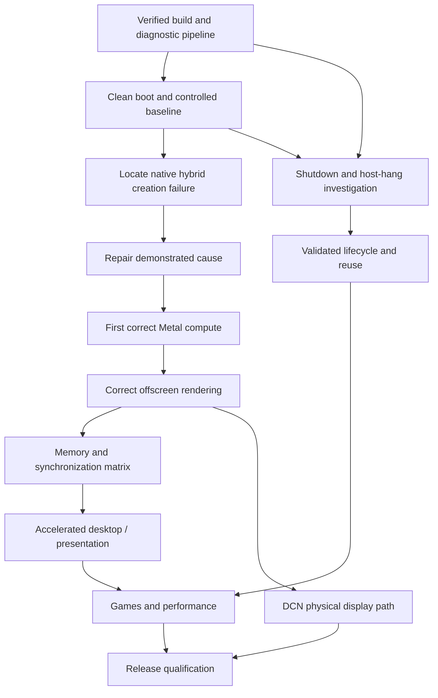

# Raphael iGPU acceleration roadmap

Updated 2026-09-08. Baseline repository: `d6e320a`; candidate: 1.0.163; published
research snapshot: `v1.0.159-preview.1`. This document is the authoritative current
roadmap. Historical hypotheses in `findings/GPU-RE.md` remain evidence, not instructions.

**Objective:** real, correct GPU compute and rendering in the Sequoia VM on the existing
Raphael iGPU, followed by usable desktop/display, repeatable lifecycle and measured game
compatibility, while protecting the host. Enumeration, compilation and a working KIQ
are intermediate milestones. No finite test can guarantee that the host will never hang.

[Task-by-task execution plan](superpowers/plans/2026-09-08-gpu-acceleration.md).

Execution update: the fresh amdgpu boot is captured, the sleep inhibitor is active,
and [the fixed baseline audit](../findings/baseline-audit.md) records enabled
interventions. Candidate 1.0.163 adds concurrent critical records and build markers.
Offline classifier/admission/staging tests pass; GPU-less delivery and the complete
one-run coordinator are still being validated. No new GPU execution claim is made.

## 1. What is actually complete

Checked means the stated deliverable exists or the stated observation was recorded.
It does **not** mean that the whole subsystem is production-ready. In particular, a
single clean run is not repeatability evidence. There is no defensible overall percentage.

| State | Deliverable | Evidence and limit |
|---|---|---|
| [x] | macOS 15.7.9 / 24G830 VM, guest command channel | Existing VM harness and root LaunchDaemon; independent of physical display |
| [x] | ATOM/VBIOS graft and Navi23 matching | Controller loads; `tools/mkrom.py`; historical ATOM findings |
| [x] | Early OpenCore + Lilu delivery | Both kexts injected into boot collection; `docs/patch-delivery.md` |
| [x] | Linux cross-build and hosted source build | `tools/build-release.py`, pinned input hashes, successful CI |
| [x] | Firmware load / TTL bring-up observed | Clean 1.0.159 serial record, including PSP responses; not all later workloads validated |
| [x] | Dummy SMU backend | Avoids retargeting Apple's messages to the host CPU's SMU |
| [x] | 256 MB VRAM allocator and initial GART root | Clean-run native physical root `0x84fdfc001`; per-client VMs remain unverified |
| [x] | KIQ setup really executes | Three stamps succeed; RPTR reaches WPTR `0x20`, `0x40`, `0x60`; not a shader test |
| [x] | Metal device enumeration | `AMD Radeon Navi23`, Metal 3 advertised; no completed Metal command buffer |
| [x] | Automated compute/render probe implemented | Fresh nonce, independent CPU/pixel expectations, timeouts; currently FAILS |
| [x] | Exposure supervision and capture implemented | Full-CID timers, serial durability, sleep inhibitor; not a host-hang fix |
| [x] | Bounded ACPI shutdown/fallback tested without GPU | Request sent; guest did not exit; exact container force-stopped |
| [x] | Wrong-kext route regression prevented for current scopes | `route-domains.py` and regression tests; not a complete C++ verifier |
| [x] | Optional hybrid diagnostic built | 1.0.162, exact entry guards, `rgpuhybrid=1`, native result preserved |
| [ ] | Hybrid diagnostic validated on hardware | Not deployed/tested; ESP still contains 1.0.159 |
| [ ] | Repeatable clean initial state | Last GPU runs reached a stuck KIQ; safe warm reuse unproved |
| [ ] | Native hybrid queues / complete engine startup | Clean run fails `TtlCreateHybridEngine` status 4 |
| [ ] | Correct Metal compute and offscreen rendering | First command buffer fails; zero results checked |
| [ ] | Per-process memory, synchronization and resource lifecycle | Must be exercised after first real completion |
| [ ] | Accelerated desktop and presentation | WindowServer panic repair is not proof of accelerated composition |
| [ ] | Physical iGPU display output | DCN 3.1.5 path remains a separate open milestone |
| [ ] | Reliable shutdown/restart and host stability | Three historical host hangs; mechanism still undetermined |
| [ ] | Supported games and performance | Zero games tested/verified; see `supported-games.md` |

Authoritative recordings:

- [Clean 1.0.159 serial](../findings/metal-tests/20260908T052603Z-8dad7535/serial.txt),
  [native probe output](../findings/metal-tests/20260908T052603Z-8dad7535/guest-output.txt).
- [GPU-less ACPI outcome](../findings/shutdown-tests/20260908-gpueless/notes.md).
- The 1.0.160/161 recordings remain archived but contain invalid diagnostic routes.
  Do not use them to attribute the hybrid failure or establish clean-run reproducibility.

## 2. Architecture decision

| Approach | Decision | Reason / condition for reconsidering |
|---|---|---|
| Keep Apple's Metal userspace and Navi23 driver; repair measured Raphael differences through Lilu | Primary path | Already reaches real KIQ execution; preserves the existing Metal/compiler/IOKit interfaces |
| Replace one proven incompatible hardware backend | Conditional fallback | Only after tracing a failure to a specific GC, SDMA, GMC, interrupt or DCN implementation; define its ABI and acceptance test first |
| Write an independent macOS GPU/Metal driver | Contingency, not current implementation | Would also require the userspace/kernel interface, compiler/ISA integration, scheduling, VM, synchronization and presentation; a register driver alone is insufficient |

Keep the current stack until evidence identifies a subsystem boundary it cannot serve.
A failed experiment is not evidence that an entire backend must be rewritten. Conversely,
three valid experiments that leave the same unexplained failure trigger an architecture
review, not another unrelated patch. No alternative requires buying hardware.

## 3. Critical path and parallel work

Static research, GPU-less harness tests and build checks may run independently. Exactly
one worker owns the physical iGPU and VM command channel. Hardware launches are serialized.
Do not switch to DCN debugging while the immediate compute/queue failure is unresolved;
read-only DCN source mapping can proceed without consuming hardware runs.

## 4. Why progress has looked random, and the replacements

| Observed problem | Required replacement |
|---|---|
| Diagnostic routes targeted the wrong binary | KDK identity + offset/ABI/entry checks + route-domain test before deploy |
| A status 4 / return 0 was interpreted without tracing its callers | Per-function return semantics and a stage classifier; ambiguous stays ambiguous |
| Repeated boots inherited queue/firmware state | Record host boot ID and handoff history; one GPU launch per clean boot until reuse is proved |
| Logs were interleaved, truncated or absent | Sequenced bounded records, explicit overflow counter, retained raw serial and guest results |
| Source, bundle, ESP and guest could differ | Immutable experiment manifest with hashes at each boundary and loaded build identity |
| Many workaround bits obscured causality | Audit every enabled intervention; frozen baseline plus one behavioral delta |
| Timeout led straight to another run | A failed cleanup contaminates the boot; no automatic relaunch |
| Metal enumeration was treated as progress toward execution | Require native completion, correct compute output and correct rendered pixels |
| Huge dumps and recompilation consumed experiment time | Precompile the probe GPU-less, cache disassembly, retain only discriminating hot-path observations |

VM disk snapshots restore guest storage only. They do not restore the physical GPU, PSP,
firmware state or host IOMMU state. Do not use snapshot rollback as a clean-GPU claim.

## 5. Ordered milestones and acceptance gates

### M0 — Make experiments identifiable and falsifiable (next; no GPU required)

- [ ] Freeze 1.0.159 as a reference observation, not as a known-good accelerated driver.
- [ ] Inventory enabled patches as compatibility fixes, observations, behavior-changing
  experiments or obsolete hypotheses. In particular, `XJ` replaces a native power-up
  loop, `XK` performs hardware writes, and some legacy logs still describe retracted ideas.
- [ ] Add an immutable experiment record and cross-check source/binary/ESP/loaded identity.
- [ ] Add deterministic result classification and diagnostic integrity checks.
- [ ] Make the small critical diagnostic records survive concurrent logging and buffer pressure.
- [ ] Remove active-container force-replacement from the normal experiment path.

Keep M0 small: extend the existing scripts and tests. No dashboard, replacement VM
framework, broad driver refactor or repeated CI builds belong on the first-run critical
path. Implement only the admission/identity/critical-record checks that prevent another
ambiguous experiment; expand case coverage when a new failure warrants it.

**Pass:** recorded good/bad/stale/corrupt fixtures classify correctly; deliberate identity
mismatches cannot launch; all current static tests pass; no hardware needed. Preserve
working fixes during this audit—do not remove several bits and call that a control run.

### M1 — Establish a controlled initial state (after the planned reboot)

- [ ] Read new host boot ID, kernel, watchdog state, journal availability, power/control,
  driver ownership and IOMMU group membership. Missing evidence is `UNKNOWN`, not `PASS`.
- [ ] While amdgpu owns the iGPU, capture approved software state: IP discovery, firmware
  versions, topology and connector/EDID data, without raw register probes or reset triggers.
- [ ] Pin reference source versions: the existing Linux reference cache is v6.12; it is
  not automatically a description of the running 7.2.3 host. Record relevant differences.
- [ ] Prepare the candidate, probe and run card before the one-way amdgpu → vfio-pci handoff.
- [ ] Permit exactly one bounded GPU launch for that boot until M7 proves warm reuse.

**Pass:** manifest proves the intended baseline and the guest reaches the target stage
without an earlier guard failure. If KIQ cannot dequeue, the run says `BASELINE_BLOCKED`;
it does not test hybrid creation. Do not immediately spend another reboot reproducing
that failure without a different discriminating plan.

### M2 — Locate the first native failure (first useful hardware question)

Question: does hybrid creation fail because hardware availability is rejected, because a
GC/SDMA queue cannot be created, or because the intended diagnostic is not actually active?

- [ ] Validate the 1.0.162 entry guards and `HY` call records on a controlled run.
- [ ] Retain actual call ordering: KIQ stamps → engine power-up → hybrid create →
  startHWEngines → Metal submission. Do not infer ordering from unrelated log timestamps.
- [ ] If needed, trace only the selected child call/flag writer at an ABI-verified boundary.

| Result | Interpretation | Next action |
|---|---|---|
| Build/entry guard absent or wrong identity | Invalid experiment | Repair delivery/observation offline; no driver fix inferred |
| KIQ fails before `HY` | Baseline failure | Analyze that earlier state; hybrid hypothesis untested |
| Availability-before=0, native status=4 | Availability hypothesis strengthened | Trace `dev+0xb0 & 7` state transitions and native branch; never clear flags to force success |
| Availability-before=1, native status=4 | Queue creation hypothesis strengthened | Identify GC vs SDMA, instance/ring/type and first failing callback; account for a concurrent availability change |
| Native status=0, startHWEngines=0 | Later failure | Trace the next native return; do not alter firmware based on this alone |
| Native startup succeeds, Metal fails | Submission path failure | Proceed to M4 stage localization, not an enumeration victory |

`available-before` is a snapshot: it cannot by itself prove which native branch ran.
`_ttlIsHwAvailable` rejects set bits 0, 1 or 2; bit 2 is not a required READY flag.
`TtlCreateHybridEngine` status 4 has multiple causes. The existing diagnostic intentionally
does not override any return or clear any status.

### M3 — Repair the demonstrated startup defect

- [ ] Trace each suspect value to its allocator/configuration owner and first writer.
- [ ] Compare hardware instance counts and queue types against this chip's discovery;
  do not infer engine presence from a successfully constructed Apple object.
- [ ] Check GC/SDMA creation parameters, memory domain, alignment and instance selection.
- [ ] Fix the smallest owner-level mismatch while preserving native failure cleanup.
- [ ] Add a regression for the decoded data transformation or dispatch decision.
- [ ] Confirm native hybrid creation returns 0, its returned handles are valid, required
  start/powerUp calls return their actual success values, and initial stamps still advance.

**Pass:** complete native startup plus subsequent M4 execution. A patch that merely
changes a return value or bypasses allocation/queue initialization cannot pass.

### M4 — First correct compute, with fault localization

- [ ] Run the existing precompiled probe, then split into diagnostic subcases only if the
  combined case cannot distinguish allocation, copy/synchronization, compute or completion.
- [ ] Follow one submission end-to-end: user Metal request → kernel client/resource VM →
  packet/IB → GPU progress/fence memory → interrupt/completion → userspace callback.
- [ ] If no progress, inspect only that engine's queue and addresses. If GPU memory/fence
  progresses but the callback does not, investigate IH/MSI/completion routing separately.
- [ ] Treat CPU addresses, guest physical, BAR offsets, MC and GPU VA as different types;
  every conversion needs a documented domain, units, range and owner.

**Pass:** Navi23 device, command status completed with no error, three compute rounds,
196,608 independently expected integer values, fresh run nonce and exit 0. Apple defines
completed/error as distinct terminal outcomes; merely receiving a completion handler is
not a success verdict. [Apple command-buffer status](https://developer.apple.com/documentation/metal/mtlcommandbuffer/status).

### M5 — Correct rendering and memory/synchronization

- [ ] Pass the existing 64×64 offscreen shader/render/readback check: all 4,096 pixels.
- [ ] Add stage-selectable copy/compute/render tests with independent expected results.
- [ ] Attribute copy/blit work to the actual selected engine when investigating SDMA;
  a Metal blit result alone does not establish which physical engine executed it.
- [ ] Test supported storage modes, managed-resource synchronization, private-resource
  upload/readback, buffer sizes 4 KiB/64 KiB/1 MiB, distinct seeds and resource recreation.
- [ ] Test sequential independent processes, then two clients/queues with non-overlapping
  data; keep initial total GPU allocations under 64 MiB and submissions bounded.
- [ ] Confirm allocation/free and page-table updates do not retain stale mappings or
  corrupt another client's data. No deliberate invalid GPU DMA or host fault injection.

**Pass:** deterministic results, no native timeout/fault, no cross-client contamination,
and resources reclaim within a measured allocator tolerance. A sample-suite pass is not
Metal 3 conformance; maintain an explicit tested-feature matrix.

### M6 — Desktop and physical display

- [ ] Verify WindowServer composition uses this device: animated content plus driver/Metal
  evidence, not the QEMU host window's acceleration or a cached screenshot.
- [ ] Test presentation through the existing VM display path first; document any copy path.
- [ ] Map the real board's connectors/HPD/AUX/PHY and DCN 3.1.5 register differences offline.
- [ ] Implement only the required DCN backend differences; validate one connector at a
  time starting at 1080p60, with changing frames and no bandwidth/memory corruption.
- [ ] Test modes, disconnect/reconnect and higher resolutions only after the first stable mode.

**Pass:** demonstrated accelerated desktop, and separately verified physical iGPU output.
Physical display work must not be mistaken for a prerequisite to an offscreen compute test.

### M7 — Lifecycle and host protection (parallel investigation; gates repeated use)

- [ ] Replace ACPI-only shutdown assumptions with a bounded request through the already
  installed root guest agent, bound to the current guest/container identity and revocable.
- [ ] Prove guest shutdown GPU-less before testing it with passthrough. Do not delay or
  disable the existing independent exposure timers.
- [ ] Trace native driver uninitialization: stop new clients, drain required work, stop
  queues/engines, release interrupts, destroy PSP rings, release referenced memory in
  the implementation's required order. Verify order from Apple and matching Linux paths.
- [ ] Distinguish four results: shutdown requested; guest exited; driver teardown observed;
  next initialization succeeds. None implies the next automatically.
- [ ] Investigate the host hangs as their own defect: preserve boot-keyed host journal,
  pstore accessibility/result and host device/PM history; correlate code paths rather
  than the last serial line. Do not intentionally reproduce a host hang for evidence.
- [ ] After teardown evidence, run a single controlled warm reuse experiment; a failure
  returns to one launch per clean host boot. Only then graduate to three bounded cycles.

**Pass:** successful native cleanup and repeatable reinitialization without force clear,
reset escalation, host lockup, IOMMU errors or persistent D-state tasks. Host stability
remains an explicit unresolved release risk until its failure mechanism is corrected or
an evidence-backed containment strategy is established. A timeout is not containment of
a fabric lockup. Suspend/resume of the host stays disabled during development; support
for it is a later separate qualification task.

### M8 — Performance, games and release qualification

- [ ] Establish GPU-time and wall-time baselines after correctness; separate boot, shader
  compile, CPU transfer and GPU execution. Set optimization targets from those measurements.
- [ ] Use a small native test app, then a named installed Metal game; record game/build,
  OS/kext/firmware, backend, resolution/settings, duration, frame times and visual defects.
- [ ] Require three independently initialized host-boot sessions with the core suite passing.
- [ ] After M7, require three successful bounded VM lifecycle cycles; do not turn this into
  an unattended autorun loop or extend the current cap to manufacture a stability result.
- [ ] Keep every initial test within the 180-second container cap and 45-second probe
  lifetime. Long gameplay/soak testing needs a separate reviewed safety plan after M7.
- [ ] Promote a release only with build hashes, passing hardware evidence and a feature/
  limitation list. Keep unsupported or untested games labeled accordingly.

**Core acceleration achieved:** M3–M5 pass on the real iGPU. **Usable accelerated VM:**
M6 desktop path and M7 lifecycle also pass. **Full roadmap complete:** physical display
qualification, M8 application coverage and documented host-stability limits are included.
These are different claims and must be reported separately.

## 6. Experiment discipline and speed targets

Every hardware experiment has a committed card containing: question, evidence motivating
it, exact baseline/candidate hashes, one behavioral delta, allowed observations, predicted
outcomes, pass/fail/invalid rules, cap, cleanup and next action for each outcome. Static
source investigation may compare many possibilities; a hardware run may not change many
of them simultaneously. Additional observations are allowed only after a side-effect audit.

Use two baselines: **historical reference** (1.0.159 clean evidence) and **current controlled
candidate** (minimal validated logging plus the same functional settings). Re-running
historical code is not mandatory just to fill a comparison table. Confirm an improvement
on another clean boot only when it supports a milestone, rather than repeating every failure.

Proposed operating targets (measure, do not claim achieved yet):

| Measure | Target |
|---|---|
| Build + local static/regression gates | Under 60 seconds excluding cold dependency fetch |
| Time spent compiling the user probe while holding VFIO | Zero |
| Hardware runs with complete identity and outcome record | 100% |
| Repeated unchanged failed experiments | Zero, except one explicitly justified reproducibility check |
| Invalid runs due to build/logging mix-ups | Zero after M0; track as harness bugs |
| GPU exposure per initial experiment | At most 180 seconds, including startup |
| Time to a classification after evidence collection | Under 60 seconds; unknown is a valid output |
| Hypothesis review threshold | Three valid experiments on one unexplained blocker |

Report after each experiment: `milestone / valid? / earliest failure / evidence / decision`.
Report progress as observed, repeatable and remaining milestones—not an arbitrary percentage.
Engineering estimates apply only to bounded tooling tasks; there is no honest completion
date for the unknown hardware defects until M2 has localized them.

## 7. Non-negotiable host boundaries

- Preserve: **"make sure we don't crash host again!"** Risk reduction is a design
  requirement; do not promise an impossible guarantee from timers/watchdogs alone.
- Never vfio-pci → amdgpu → vfio-pci within a boot. No virgin VFIO path, forced HQD
  disable, PSP MODE1 reset, host SMU retarget, or enabling retired CP experiments.
- Do not change kernel signing, Secure Boot, Limine or initramfs to accelerate iteration.
- Keep the dGPU/host display and unrelated SoC functions out of experiments.
- No `sudo -n`. Build, tests, guest commands and Docker supervision run unprivileged.
  Use privileged access only for the reviewed one-way device handoff or a specific
  required protected read, with the established askpass mechanism; do not probe sudo.
- Reads of device interfaces are not automatically harmless. Linux documents that
  reading `amdgpu_test_ib` submits work and reading `amdgpu_gpu_recover` resets the GPU.
  Exclude them from passive capture; review raw register access for read side effects.
  [AMDGPU debugfs semantics](https://docs.kernel.org/gpu/amdgpu/debugfs.html).
- VFIO/IOMMU isolation does not by itself prove that shared APU reset/power resources
  are isolated. Linux documents both VFIO group ownership and shared APU components.
  [VFIO](https://docs.kernel.org/driver-api/vfio.html),
  [AMDGPU hardware structure](https://docs.kernel.org/gpu/amdgpu/driver-core.html).

## 8. Resume after the planned reboot

1. Verify the host boot ID changed and no VM is running; renew/verify sleep inhibition.
2. Inspect iGPU ownership and collect approved reference state **before** any handoff.
3. Complete the M0 offline/GPU-less gates. A reboot does not authorize skipping them.
4. Prepare one M2 experiment; verify the candidate actually in the ESP and the probe ready.
5. Make the one-way handoff if required, start one bounded run, classify it, archive it,
   stop and honor the outcome's next action. A stuck queue closes that boot's GPU testing.

No VM launch, handoff, reboot or hardware reset was performed while writing this plan.
