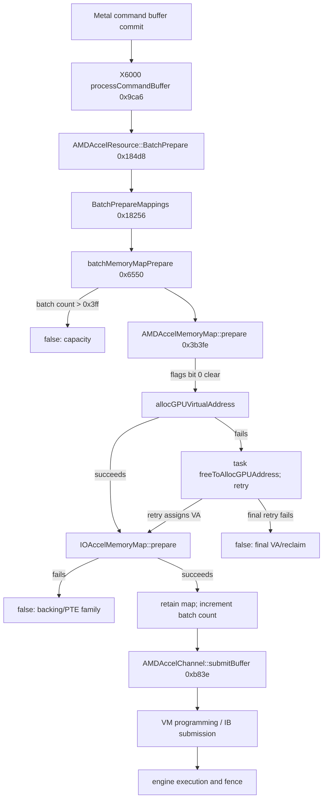

# Metal-to-desktop integration on Raphael: an evidence-led map

**Research date:** 2026-09-09  
**Target:** macOS 15.7.9 build 24G830, `AMDRadeonX6000`, Raphael iGPU exposed as Navi23  
**Scope:** the path from Metal resource creation through GPU virtual memory, submission,
execution, readback, rendering, and presentation. This is an offline analysis. It neither
changes the driver nor claims hardware behavior that has not been observed.

## Finding

The project has crossed the API-discovery boundary but has not crossed the first native
resource-preparation boundary. Candidate 177 proved that macOS enumerates `AMD Radeon Navi23`,
advertises Metal 3, compiles the probe's shaders, creates compute pipelines, a command queue,
and two managed buffers. The first committed command nevertheless ends in Metal status 5 with
underlying IOKit status `0xe00002bd`, which the 24G830 SDK defines as
`kIOReturnNoMemory`. The X6000 trace observes the enclosing resource batch fail after
`batchMemoryMapPrepare` returns false and observes **zero** calls to
`AMDAccelChannel::submitBuffer`.[^local-177][^local-176]

That ordering is decisive. The current first blocker is before channel submission and before any
observed workload VMID-2/SDMA program, command-processor fetch, shader execution, fences, render
correctness, and desktop presentation. It may already be inside a CPU-side/native page-table
commit attempt, which candidate178 cannot split. Apple describes `commit` as the point that submits a
command buffer into Metal's scheduling flow; successful object and pipeline creation before it
does not imply that the GPU ran anything.[^apple-command] Candidate 177 therefore establishes
Metal API integration, not acceleration.

Candidate 178-A has now subdivided the already-proven failing function without adding another
route. Its final post-call state separates:

1. the native mapping-batch capacity fast path;
2. final GPU virtual-address allocation/reclaim failure; and
3. a failure after a GPU virtual address is assigned, in backing preparation or PTE work.

The A run recorded 483 failed outer calls: capacity 0, VA/reclaim 0, backing/PTE 483,
unknown 0. The two retained samples are the same map and show unchanged pre/post state
`batch=0`, `prepare=0`, `flags=0xb13`, `GPUVA=0x4000c0000`. `submitBuffer` remains at zero,
and the unchanged probe again reports status 5 / `e00002bd` with no completed command or
validated value.[^local-178a] The identical candidate178-B build then recorded 531 failed calls,
again capacity 0, VA/reclaim 0, backing/PTE 531, unknown 0, with the same retained field values,
zero submits, and the same zero-work Metal result.[^local-178b] This repeat rules out the
batch-capacity and final VA-allocation branches for the observed failures. It makes downstream
backing/wiring or PTE commit the first family to split. It does not prove that every failed
background call belongs to either probe.

The observation is intentionally phrased as the **final blocking phase after native retries**.
It cannot identify the first failed attempt or associate every background map with the probe.

## What each success level would prove

| Level | Required observation | What it proves | What remains open |
|---|---|---|---|
| Device exposure | `MTLCopyAllDevices` returns Navi23; Metal 3 advertised | IOKit/Metal publishes a usable API object | Memory preparation and all GPU work |
| Front-end API | shader library and pipeline creation succeed | Metal accepts and compiles the program for the published device | Resource residency, submission, execution |
| Resource preparation | all maps prepare and `BatchPrepare` succeeds | Required resources acquired GPU-visible placement/backing far enough for the batch | Channel submission and hardware consumption |
| Submission | `submitBuffer` entered; queue/ring producer advances | Driver handed an IB/job toward an engine | Correct VM root, fetch, execution, completion |
| Execution | engine consumes work and a fence advances | Hardware processed the submitted stream | Numerical correctness and cache visibility |
| Compute readback | 196,608 expected values across three rounds | compute, writes, managed coherency, and CPU visibility work | render and presentation |
| Offscreen render | 4,096 RGBA pixels match | VS/PS, raster, private render target, blit, and readback work | drawable/window/display lifecycle |
| Drawable presentation | CAMetalLayer drawable is rendered and presented | application-level onscreen Metal path works | WindowServer stability and full desktop lifecycle |
| Desktop lifecycle | repeated WindowServer use, sleep/wake/restart/shutdown survive | practical full desktop acceleration for the qualified setup | broader hardware/configuration coverage |

These levels must remain separate. Apple documents command buffers as containers whose commands
are scheduled after commit, and provides distinct scheduled and completed notifications.[^apple-command]
Likewise, a CAMetalLayer supplies Metal-backed drawable content; drawable acquisition and
presentation add a surface lifecycle that the current offscreen probe never exercises.[^apple-layer][^apple-drawable]

## The current probe is a compound first command

The first failing command is not an isolated shader dispatch. The exact probe source creates two
`MTLResourceStorageModeManaged` buffers, each 65,536 32-bit elements (256 KiB). It writes both
from the CPU, calls `didModifyRange:` on each, encodes a compute dispatch, then encodes
`synchronizeResource:` for the output in the same command buffer before committing it. Only a
successful completion is followed by checking every output word.[^local-probe]

This matches Apple's managed-resource model: CPU and GPU copies require explicit direction-aware
synchronization on macOS.[^apple-managed] It also means the observed failed mapping batch may
belong to an input buffer, output buffer, pipeline/command storage, coherency operation, or another
framework resource. Pipeline creation and `newBufferWithLength:` returning objects show that
front-end allocation succeeded. They do not show that backing was resident, assigned a per-client
GPU address, or entered page tables when the command was prepared.

The render phase has not been reached. If compute eventually passes, the same probe builds a
private 64×64 RGBA8 render target, draws a triangle, blits it into a managed readback buffer,
synchronizes that buffer, and verifies all 4,096 pixels. It therefore tests more than rasterization:
private-resource placement, render-target layout, shader execution, blit, caches, managed
coherency, and CPU readback all have to agree.[^local-probe]

## Exact 24G830 resource-preparation path

The private implementation claims below are based on the exact 24G830 X6000 executable at
`/home/bogdan/macos-vm/kdk/x/System/Library/Extensions/AMDRadeonX6000.kext/Contents/MacOS/AMDRadeonX6000`,
SHA-256 `2e364270c3243c532a9428c670313d5afd20406e42d64edb4fa8f3572504104e`,
and the extracted IOAcceleratorFamily2 member, SHA-256
`1700f3badafbb9014d55b7f6ecde5cdff0d585bd1f0e143c9f8465e4466e5d35`.[^local-forensics]
They are build-specific, not public ABI.

### Batch preparation

`AMDAccelResource::BatchPrepareMappings` at `0x18256` begins a mapping batch and walks the
resource mappings. A mapping whose prepare count is zero enters
`batchMemoryMapPrepare`. On failure the function exits with the number of mappings processed,
which is a count rather than a Boolean. `AMDAccelResource::BatchPrepare` at `0x184d8` consumes
that count and can fall back to per-resource preparation; its final false result is the decisive
outer failure. Candidate 177 captured both zero mapping progress and the final false result, so
the conclusion does not depend on misreading the count as a Boolean.[^local-forensics]

### Per-map preparation

`AMDGraphicsAccelerator::batchMemoryMapPrepare` at `0x6550` first accepts a map with a nonzero
prepare count. Otherwise it rejects a new entry when accelerator field `+0x1fb0` is greater than
`0x3ff`. On successful preparation it retains the map, stores it in the batch, and increments
that count. Every false path leaves the count unchanged.[^local-phase]

The function invokes the map's prepare method and, on failure, tries native system/video-memory
reclaim or page-on fallbacks before retrying the target map. Those paths can make a later attempt
succeed even if the first VA request failed. This is why the candidate178 observer reports a
settled final phase, not first cause.

### VA assignment versus downstream preparation

`AMDAccelMemoryMap::prepare` at `0x3b3fe` checks flags bit 0. If no GPU virtual address is assigned,
it calls `allocGPUVirtualAddress`; on allocation failure it asks the owning task to free GPU
address space and retries. Once an address is assigned it tail-calls the IOAccelerator superclass
prepare path.[^local-phase]

The relevant map fields are:

| Field | Meaning established for 24G830 | Interpretation |
|---|---|---|
| `map+0xc`, `uint32_t` | prepare count | nonzero entry is the native success fast path; false cannot leave it nonzero |
| `map+0x10`, `uint32_t` bit 0 | GPU VA assigned | authoritative phase discriminator |
| `map+0x10` bit `0x20` | permits raw address zero | `GPUVA==0` alone is not failure; assigned state can be flags `0x21`, address 0 |
| `map+0x98`, `uint64_t` | raw GPU VA | corroboration only |
| `accelerator+0x1fb0`, `uint32_t` | prepared maps in current batch | `>0x3ff` triggers capacity rejection; false leaves it unchanged |

`allocGPUVirtualAddress` writes the raw address and sets bit 0 only after success.
`IOAccelMemoryMap::prepare` does not clear the assigned state if later backing/PTE work fails;
the explicit free-VA path does. The native outer fallbacks free other objects and retry the target,
without clearing the target's settled assigned address. Consequently:

- final bit 0 clear means the target still could not acquire VA after reclaim/retry;
- final bit 0 set means VA assignment survived and the final blocker is later in backing or PTE
  preparation;
- a `backing-pte` result can hide an earlier VA miss that was recovered;
- successful raw VA zero is legal when assigned, so address zero never chooses the class.

## What candidate177 proved and what its trace could not prove

Candidate 177 observed balanced totals of 181 queue process calls, 540 mapping batches, 543
resource batches, 540 per-map preparations, and zero channel submissions. The retained order was
map false → mappings zero progress → BatchPrepare false → queue `e00002bd`. This occurred across
at least two queue objects and two map objects.[^local-177]

The normal and notable sample buffers overflowed. Lifetime counters continued, and the independent
critical replay completed, but records have kernel object and worker-thread tokens rather than a
guest PID, probe nonce, or timestamp. The shutdown aggregate spans the probe interval, and every
retained queue exit has the same error, so the path is strongly consistent with the probe failure.
It is not a one-to-one object attribution. That limitation should govern candidate178 too: phase
counts describe failed outer map-preparation calls, and a sample's thread is the kernel callback
worker identity.

The absence of VMID-2 and SDMA callback records is now explained by the earlier boundary. It is
not affirmative evidence of an SDMA fault and need not be treated as a logging bug. Work never
reached the instrumented `submitBuffer` boundary.

## Candidate178's bounded phase observer and A result

Candidate178 reuses the already-reviewed `batchMemoryMapPrepare` route. Only after the existing
all-routes-ready and Raphael-target gates pass does the wrapper copy the four fields before and
after exactly one native call. It preserves the native Boolean and does no MMIO, allocation, wait,
or formatted log work in the callback.[^local-phase]

For a failed native call it classifies:

1. **unknown** for unavailable or internally inconsistent snapshots, including nonzero prepare
   count, changed batch count, or assigned bit changing from 1 to 0;
2. **capacity** for an unchanged fast-path snapshot with entry batch count `>0x3ff`;
3. **va-allocation-reclaim** when final assigned bit is clear;
4. **backing-pte** when final assigned bit is set.

The store retains only two samples per failure class but keeps atomic lifetime class counters after
sample saturation. A separate bounded summary cadence publishes settled counts. This answers the
phase question even under the background traffic that overflowed candidate177's detailed trace.
It deliberately does not claim probe PID association or split backing allocation from PTE commit.

Candidate178-A/B's coherent, all-`backing-pte` results move VA allocator exhaustion and capacity out
of the leading position. The most informative next observation is whether
`AMDAccelMemoryMap::commitIntoGPUPageTable` is called and what it returns. In the exact X6000
binary this method is at `0x3b4d2`, has ABI `bool(map *)`, and begins with the complete 17-byte
non-relative span `554889e5415741564155415453504889fb`. Its body chooses between two native
commit callbacks based on task byte `task+0x268 == 1`: the mode-1 path calls the object at
`task+0x260`, vtable slot `+0x120`; the alternate path calls the raw target object at `map+0x118`,
vtable slot `+0x130`. Both Boolean results drive bit `0x40` in `map+0x138`, set on failure and
cleared on success.[^local-x6000-commit]

A single bounded entry/result observer at this method can answer two questions in one run:

- no commit entry while the outer call fails means the superclass preparation stopped before
  this commit boundary, favoring backing/wiring;
- a commit entry returning false proves a page-table commit callback rejected the map, and the
  task mode identifies which native branch ran.

The useful scalar context is the task pointer `map+0x90`, task mode `task+0x268`, raw alternate
target pointer `map+0x118`, raw field `map+0x18`, raw GPUVA `map+0x98`, and full `map+0x138`
pre/post flags. The semantic meaning of `map+0x18` and `map+0x118` is not yet proven. The native
mode-1 branch also obtains a callback argument from map vtable slot `+0x168`; the current observer
must not invoke that method a second time. Observing that value would require a separately proven
inside-callback boundary. Constructor/getter/caller evidence should first establish the raw-field
semantics offline. The wrapper must preserve
the native Boolean and keep the same all-routes-ready/Raphael gate before field reads. This is a
design proposal, not an implemented or authorized route.

## GPU virtual memory and submission after preparation

The Linux AMDGPU implementation is not evidence of Apple's private call graph, but it is a useful
public architectural cross-check for the same RDNA2 hardware. AMDGPU documents GTT as GPU-accessible
system memory mapped through GART, VRAM as device-local memory or an APU carveout, and GPUVM as
multiple protected virtual-address spaces.[^amdgpu-core][^amdgpu-glossary] It also identifies SDMA
as an engine used for paging and GPU page-table updates, while GC contains the graphics/compute
pipeline and command processors.[^amdgpu-core]

Linux's v6.12 VM implementation separates preparation of update storage, construction/emission of
PDE/PTE updates, and commit with a fence; its SDMA backend allocates an update job before emitting
and submitting it.[^linux-vm][^linux-vm-sdma] This supports a disciplined interpretation of
candidate178's `backing-pte` bucket: several distinct resources can fail after VA assignment.
It does **not** license translating Linux errno values or function names directly into Apple's
`e00002bd`.

Only after X6000 reaches `AMDAccelChannel::submitBuffer` at `0xb83e` should investigation pivot to:

- the per-client GPUVM root and VMID selected for the workload;
- page-table contents and invalidation ordering;
- IB address, size, engine, and channel;
- queue/MQD/HQD activation and producer/consumer movement;
- SDMA paging work if the Apple path uses it;
- engine fence emission and interrupt completion.

AMDGPU's public ring model describes software advancing a write pointer, the engine consuming
packets by advancing a read pointer, and IBs holding the larger command stream.[^amdgpu-ring]
Its debug interface distinguishes emitted and signalled fence sequence numbers; equality means a
ring is idle, while emitted ahead of signalled means work remains.[^amdgpu-debugfs] Those are the
right conceptual observations once submission exists. They are downstream of the current failure.

## Execution, coherency, and correctness

A first `submitBuffer` call still would not prove acceleration. Evidence should advance in this
order:

1. **Driver submission:** the native channel function is entered and returns along its normal
   path, with the intended IB address and engine.
2. **Hardware consumption:** queue producer/consumer or equivalent hardware state advances.
3. **Completion:** the relevant fence is emitted and then signalled; the command buffer reaches
   completion without error.
4. **Compute correctness:** the probe's expected words match, proving shader execution and
   GPU-to-CPU visibility rather than a stale or untouched buffer.
5. **Repeatability:** three rounds and, separately, the two same-build warm runs behave consistently.

The current probe's sentinel output (`0xdeadbeef`) and per-element formula are valuable because a
completed status alone cannot distinguish correct shader output from stale memory. The managed
output synchronization also tests cache/coherency behavior. If submission later succeeds but the
values mismatch, investigation should move to shader ABI/ISA, resource binding, cache flushing,
and synchronization rather than revisiting the now-passed allocation gate.

AMD's RDNA2 ISA specification is the primary reference for instruction encoding and execution
semantics once an actual shader stream runs.[^amd-rdna2] Until then, an ISA hypothesis has poor
explanatory power for a failure that occurs before `submitBuffer`.

## Render and presentation are separate systems

Offscreen rendering exercises GC and memory paths but still does not prove desktop output. A
successful private render target plus managed readback would establish render-pipeline correctness
for the tested format and resource path. It would not establish drawable acquisition, IOSurface
sharing, WindowServer composition, scanout, hotplug, cursor planes, or lifecycle behavior.

At the application layer, `CAMetalLayer` is the Core Animation layer that vends Metal drawable
textures, while `MTLDrawable` supplies presentation timing and lifecycle APIs.[^apple-layer][^apple-drawable]
A later on-screen test should therefore check acquisition, encode-to-drawable, present, completion,
and repeated frame turnover independently from the current offscreen pixel test.

In this VM, host-window presentation has an additional boundary. QEMU 10.1.2's VFIO display probe
asks the VFIO device for a GFX plane exported as DMABUF, then as a REGION. If neither query succeeds,
automatic mode silently continues without attaching a display, whereas an explicit display request
errors.[^qemu-vfio-display] Thus plain `vfio-pci,display=on` cannot be assumed to bridge Raphael's
macOS scanout to a QEMU console. The host kernel/device would have to expose one of those VFIO GFX
plane mechanisms. QEMU's virtio-gpu documentation describes a separate paravirtual guest display
device with Linux guest support and optional virgl/rutabaga transports; it is not a macOS Radeon
surface bridge.[^qemu-virtio]

Physical-output qualification is separate again. DCN is the display controller, whereas GC is the
graphics/compute engine and SDMA is a DMA/paging engine.[^amdgpu-core] Correct offscreen Metal can
coexist with broken DCN link training or connector state; conversely, a visible boot framebuffer
does not prove Metal execution.

## Diagnostic sequence after candidate178

The next action should be selected by the settled phase counts, not by running all hypotheses in
parallel.

### If `capacity` is nonzero

First establish why `accelerator+0x1fb0` enters above `0x3ff`: capture the batch entry count at the
outer BatchPrepare boundary and the batch reset/end transitions, using the smallest safe existing
scope. Acceptance is a reproducible over-limit count immediately before each failure; refutation is
zero capacity failures with coherent snapshots. Do not change the threshold: `0x3ff` is accepted
and `0x400` is the first rejected entry value in this build.

### If `va-allocation-reclaim` dominates

Focus on the IOAccel GPU-VA allocator/task state and its retry. The smallest useful observation is
the requested range/alignment, allocator extent/free totals before and after the native allocation,
and whether `freeToAllocGPUAddress` reports progress, all at reviewed build-specific boundaries.
Acceptance is final assigned bit clear plus a failed allocator result after retry with insufficient
or inconsistent extent state. Refutation is assigned bit set on the final false calls.

The duplicate `enableAllocations`/`init_pool` sequence becomes more relevant in this branch. The
framework's exact `init_pool` clears and rebuilds list state, and the driver currently reaches it
twice on the same objects. There is no evidence of a live allocation between the two calls or an
allocation-failure log, so the observation must come before any behavioral fix.[^local-forensics]

### If `backing-pte` dominates (the observed A result)

Keep the successful assigned bit as the anchor. Split the superclass prepare failure into backing
acquisition/residency versus page-table update/commit with one reviewed return-code observation or
caller-visible state transition. Capture scalar results and identifiers only; do not add five broad
framework routes. The exact `commitIntoGPUPageTable` method above is the narrow candidate.
Acceptance for backing failure is an assigned VA followed by an outer false result with no commit
entry. Acceptance for PTE failure is a commit entry whose native Boolean is false. A final assigned
address alone does not choose between them.

### If `unknown` dominates

Treat the observer as insufficient. Examine the exact inconsistency first: unavailable pointer,
nonzero prepare count on false, changed batch count, or assigned-bit teardown. Do not fold unknown
into VA failure. A coherent second observation may be needed before modifying behavior.

### Only after the phase is localized

A separately approved minimal workload matrix can remove the current probe's coupling:

1. shared buffer with no managed synchronize command;
2. managed input/output with explicit synchronization, matching the current semantics;
3. private working resource with a small shared/managed transfer resource;
4. blit-only copy and synchronize without a shader;
5. compute-only dispatch with the smallest resource set, followed by a separate readback command.

Keep sizes, contents, and validation deterministic. This matrix asks whether failure follows storage
mode, coherency command, resource count, or shader work. It must not replace candidate178's unchanged
workload while A/B qualification is in progress.

## Known constraints and rejected overclaims

- **Not physical exhaustion yet.** `kIOReturnNoMemory` names a failure class, but no retained native
  allocation result proves that VRAM or system RAM was exhausted.
- **Not a GPU execution fault yet.** `submitBuffer` remained at zero; no workload reached the
  instrumented native submission boundary.
- **Not an SDMA/VMID callback defect yet.** The earlier resource failure explains the absent
  callbacks.
- **Not a shader-compiler success story.** Compilation proves front-end acceptance only.
- **Not a display result.** The probe is offscreen and never reached rendering.
- **Stale PSP is not the sole blocker.** Native startup and engine initialization succeeded after
  the retained recovery flow. That narrows one causal theory; it does not prove every PSP behavior
  correct.
- **The global paging channel is present.** Candidate178-B captured nonnull native memory fields
  at `+0x20`, `+0x28`, and `+0x30`, including the DMA paging channel, before and after native
  memory-allocation enablement. A simple missing-global-channel theory conflicts with that state;
  per-client commit state remains open.
- **A logged `setVirtualSpaceReady(1)` numeric return is not evidence.** The current wrapper declares
  a 32-bit return but the native setter ABI has not been proven and may be `void`; the observed
  integer must not be classified as success or failure.
- **The initial GART/root evidence is necessary but incomplete.** Kernel/global VM state does not
  establish correct per-client GPUVM mappings for a Metal resource.
- **Warm A/B primarily qualifies lifecycle.** A repeated phase distribution is useful diagnostic
  evidence, but it does not create probe-object identity or turn an aggregate trace into a single
  call correlation.

## Sources

[^local-177]: Private run evidence: `/home/bogdan/macos-vm/run/metal-010-177/serial.txt`, SHA-256 `31dcc1693caf6873e1855d09dcabc9f32599123a02f531262cc4652a70fc6ecb`; `events.jsonl`, SHA-256 `9813152e5403cfc2b4f6d947c2a36ae8fc93cb7ecafd0817ed9330b8de0cd01c`; `probe.json`, SHA-256 `c99cc1a314b4257c6337626dd36688d9d4e60092847c3bb1d4be0bc6db795b9a`; archived analysis `/home/bogdan/src/macos-raphael-igpu/findings/experiments/metal-010-177/notes.md`, SHA-256 `d0667b1a9c0939b7c97f20af8b17e098d1c024087f4349aff04138be80cc302c`.
[^local-176]: Private analysis: `/home/bogdan/src/macos-raphael-igpu/findings/experiments/metal-009-176/submission-failure-forensics.md`, SHA-256 `e93a8a6b3e2ee411ffa8126aa5ff3e1dbe7a45d68a48392bc773674be8552423`.
[^local-probe]: Exact probe: `/home/bogdan/src/macos-raphael-igpu/tests/metal_probe.m`, commit `ef326108b868a00efb292e481ea2efb866205efa`, SHA-256 `f0fc0ced81fe70732c3491cff1557a83d85c9ccb8c18a6303f9070ae1f969d77`, especially lines 108–151 and 153–197.
[^local-forensics]: Exact build-specific disassembly and ABI evidence: `/home/bogdan/src/macos-raphael-igpu/findings/experiments/metal-009-176/submission-failure-forensics.md`, SHA-256 `e93a8a6b3e2ee411ffa8126aa5ff3e1dbe7a45d68a48392bc773674be8552423`. X6000 offsets: `processCommandBuffer` `0x9ca6`, `BatchPrepareMappings` `0x18256`, `BatchPrepare` `0x184d8`, `batchMemoryMapPrepare` `0x6550`, `submitBuffer` `0xb83e`, excluded `setSubmissionError` `0xace4`. IOAcceleratorFamily2 offsets: `IOAccelMemoryAllocator2::init_pool(uint64_t,uint64_t)` `0x1f8e8`, inner `init_pool(uint64_t)` `0x1f784`.
[^local-phase]: Exact phase semantics and observer rationale: `/home/bogdan/src/macos-raphael-igpu/findings/experiments/metal-010-177/memory-map-phase-design.md`, SHA-256 `cfd1a7ed410bb418fc15aff6b5b9f6849e8cb628e29ae88bcdc68f7e9be85f59`. X6000 SHA and offsets as above; `AMDAccelMemoryMap::prepare` is `0x3b3fe` and deliberately is not routed.
[^local-178a]: Private candidate178-A output: `/home/bogdan/macos-vm/run/metal-011-178-a/events.jsonl`, SHA-256 `bca76681ba59335cd4da50815774307ca5cf6bca47ee84a3c3d766a12187a016`; `probe.json`, SHA-256 `076bbc22f0922827ab1d8eda362fa13dea80e2118ab58a1e3e33d76b47e4e743`; `serial.txt`, SHA-256 `c4a877508517dc78402e0b82c42dd5a2a20113a90965a27f92f5b0b6d7ac918`; build ID `5908f278b80548d6b9c88e2e9a300ae5`, run ID `f103e47500ed4a06ae346df23250d95d`.
[^local-178b]: Private candidate178-B output: `/home/bogdan/macos-vm/run/metal-011-178-b/events.jsonl`, SHA-256 `ece23f169283c148b1e5b5b758e539218bf3f20ca6226860ab68b35746455966`; `probe.json`, SHA-256 `b49d5d2c9a2fcf7408ea26d237f2ed11281604c69c0e9805d47ff9677bc61755`; `serial.txt`, SHA-256 `a5b1317d78c52b22d776feec72bb91877b82000c2eb16d03f0d62f9a7d98201c`; build ID `5908f278b80548d6b9c88e2e9a300ae5`, run ID `4a45f4a4c1dd49c69fab2dc37e2e4898`.
[^local-x6000-commit]: Private exact disassembly: `/home/bogdan/macos-vm/re/x6000.asm`, lines 64585–64667, derived from X6000 SHA-256 `2e364270c3243c532a9428c670313d5afd20406e42d64edb4fa8f3572504104e`; `AMDAccelMemoryMap::commitIntoGPUPageTable` offset `0x3b4d2`, entry bytes `554889e5415741564155415453504889fb`.
[^apple-command]: Apple, [Setting up a command structure](https://developer.apple.com/documentation/Metal/setting-up-a-command-structure).
[^apple-managed]: Apple, [Synchronizing a managed resource in macOS](https://developer.apple.com/documentation/metal/synchronizing-a-managed-resource-in-macos) and [Setting resource storage modes](https://developer.apple.com/documentation/metal/setting-resource-storage-modes).
[^apple-layer]: Apple, [CAMetalLayer](https://developer.apple.com/documentation/quartzcore/cametallayer).
[^apple-drawable]: Apple, [MTLDrawable](https://developer.apple.com/documentation/metal/mtldrawable) and [present](https://developer.apple.com/documentation/metal/mtldrawable/present()).
[^amdgpu-core]: Linux kernel documentation, [AMDGPU Core Driver Infrastructure](https://docs.kernel.org/gpu/amdgpu/driver-core.html), sections “GPU Hardware Structure,” “Memory Domains,” and “GPU Virtual Memory.”
[^amdgpu-glossary]: Linux kernel documentation, [AMDGPU Glossary](https://docs.kernel.org/gpu/amdgpu/amdgpu-glossary.html), entries GART, GPUVM, GTT, PTE, SDMA, and VMID.
[^linux-vm]: Linux v6.12 primary source, [`amdgpu_vm.c`](https://github.com/torvalds/linux/blob/v6.12/drivers/gpu/drm/amd/amdgpu/amdgpu_vm.c), particularly `amdgpu_vm_update_pdes` and its prepare/update/commit sequence.
[^linux-vm-sdma]: Linux v6.12 primary source, [`amdgpu_vm_sdma.c`](https://github.com/torvalds/linux/blob/v6.12/drivers/gpu/drm/amd/amdgpu/amdgpu_vm_sdma.c), especially SDMA VM `prepare`, `commit`, and PTE/PDE update helpers.
[^amdgpu-ring]: Linux kernel documentation, [AMDGPU Ring Buffer](https://docs.kernel.org/gpu/amdgpu/ring-buffer.html), producer/consumer, rptr/wptr, and IB sections.
[^amdgpu-debugfs]: Linux kernel documentation, [AMDGPU DebugFS](https://docs.kernel.org/gpu/amdgpu/debugfs.html), `amdgpu_test_ib`, ring, fence, and VM information sections.
[^amd-rdna2]: AMD, [RDNA 2 Shader Instruction Set Architecture](https://www.amd.com/content/dam/amd/en/documents/radeon-tech-docs/instruction-set-architectures/rdna2-shader-instruction-set-architecture.pdf).
[^qemu-vfio-display]: QEMU 10.1.2 primary source, [`hw/vfio/display.c`](https://raw.githubusercontent.com/qemu/qemu/v10.1.2/hw/vfio/display.c), `vfio_display_probe`, lines 478–502.
[^qemu-virtio]: QEMU documentation, [VirtIO GPU](https://www.qemu.org/docs/master/system/devices/virtio/virtio-gpu.html).
